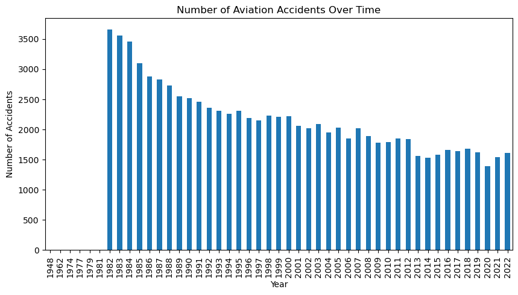
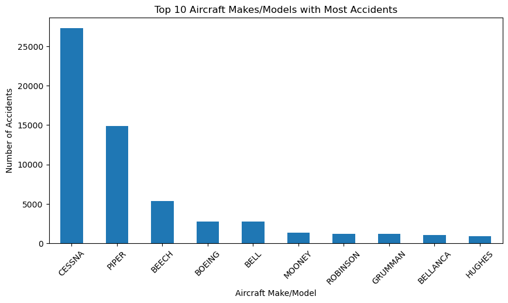
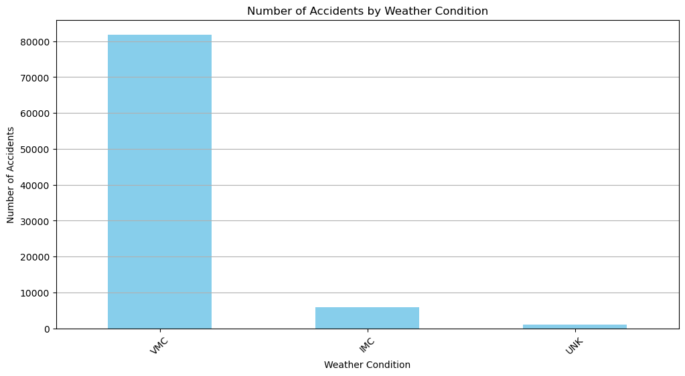
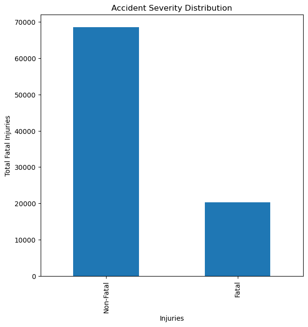

# Aircraft Risk Assessment for a New Business Endeavour.

This project seeks to guide the company as it ventures into operation of commercial and private airplanes. The main focus is on comparing the risk levels of different aircraft makes and come up with aircraft models that present the lowest risk and highest potential for successful operations.
Using Exploratory Data Analysis(EDA), the dataset from the National Transportation and Safety Board is used to profile the Aircraft models into either low risk or high risk depending on the number of accidents recorded.

#### Objectives

* Determine the lowest-risk aircraft options for the company's expansion into the aviation industry.
* Evaluate various Aircraft Models in terms of reliability and market reputation by looking into the number of accidents the model was involved in over time.
* Use Exploratory Data Analysis(EDA) to clean the dataset, aggregating and formulating visualization tools for a clear presentation.
* Create an interactive dashboard so that the users can explore the analysis.
* A summary of the key insights from the Analysis and recommendations for the company.

#### Exploratory Data Analysis

In this project, we are going to use analytical skills to determine the lowest risk aircraft options for the company's expansion into the aviation industry. We will use Aviation_Data.csv from the National Transportation Safety Board that includes aviation accident data from 1962 to 2023.
From the csv file used in this project, there are a total of  90348 entries and 32  columns.

#### Import the Relevant Libraries and read the data

`python
import pandas as pd
import numpy as np
import matplotlib.pyplot as plt
import seaborn as sns
%matplotlib inline
df = pd.read_csv('Aviation_Data.csv', dtype={6: 'object', 7: 'object', 28: 'object'})
df.head()
`
#### Getting rid of all columns with a threshold of more than 30% missing values.

`python
percent_missing = df.isnull().mean() * 100
missing_value_df = pd.DataFrame({'column_name': df.columns, 'percent_missing': percent_missing})
missing_value_df.sort_values('percent_missing', inplace=True)
print(missing_value_df)
df = df.loc[:, df.isnull().mean() < 0.3]
df.head()
`
#### Treat the remaining Null values with *mean* for all numerical columns and *mode* for categorical columns

`python
numerical_cols = df.select_dtypes(include=['number']).columns
categorical_cols = df.select_dtypes(exclude=['number']).columns
numerical_means = df[numerical_cols].mean()
categorical_modes = df[categorical_cols].mode().iloc[0]
df[numerical_cols] = df[numerical_cols].fillna(numerical_means)
df[categorical_cols] = df[categorical_cols].fillna(categorical_modes)
`
#### Look for duplicates and drop them from the dataset.

`python
duplicates = aviation_data.duplicated().sum()
duplicates
aviation_data= aviation_data.drop_duplicates()
`
#### Treat the outliers using the Interquartile Range (IQR).

`python

def treat_outliers(aviation_data, column):

    Q1 = aviation_data[column].quantile(0.25)

    Q3 = aviation_data[column].quantile(0.75)

    IQR = Q3 - Q1

    lower_bound = Q1 - 1.5 * IQR

    upper_bound = Q3 + 1.5 * IQR

    median = aviation_data[column].median()

    aviation_data[column] = aviation_data[column].apply(lambda x: median if x < lower_bound or x > upper_bound else x)

for col in aviation_data.select_dtypes(include=['number']).columns:

    treat_outliers(aviation_data, col)
`

# Graphical Presentations

#### Number of Accidents over the Years

A graph showing the number of accidents since 1942.

From the above graph, 1982 is the year that had most occurences of accidents. 
However, the number of accidents tends to go down two decades later.
The reduction of the accidents may be due to production of new models of aeroplanes.

#### A bar graph showing the top 10 Makes and Models with high number of accidents

From the above graph, we can conclude that the Aircraft make with highest number of Accidents is Cessna.
This make has over 25000 accidents since 1982 to 2022 which is a very high number compared other makes.
Let's see which make has the least number of accidents since 1982 to 2022

#### Yearly Number of Accidents Per Make

The above graph shows top 10 makes and the number of accidents per year.
Cessna Make is leading with the highest number of accidents, followed by Piper and Beech

#### 10 Makes with least number of accidents

Plotting a graph Aircraft Makes against the Number of accidents associated with the make.

There are 6133 makes with accident occurences less than two. 
Mckinnis, Aeronca-Bubeck Irving, Trike and 6130 more have incidents below 2.
The above graph gives 10 Aircraft makes with number of accidents less than 2.

#### Number of Accidents as Per Weather Conditions

A graph showing number of accidents in different weather Conditions.

In aviation, instrument meteorological conditions (IMC) are weather conditions that require pilots to fly primarily by reference to flight instruments, and therefore under instrument flight rules (IFR), as opposed to flying by outside visual references under visual flight rules (VFR). Visual meteorological conditions (VMC) is an aviation flight category in which visual flight rules (VFR) flight is permitted—that is, conditions in which pilots have sufficient visibility to fly the aircraft maintaining visual separation from terrain and other aircraft. From the above graph, the number of accidents occuring from VMC are high compared to IMC weather conditions. This would mean that when there is sufficient visibility, that is under Visual Meteorological Conditions(VMC), the pilot is not required to apply the IFR(Instrument Flight Rules), the number of accidents go higher. However, when there is poor visibility due to poor weather conditions, that is under Instrument Meteorological Conditions(IMC), the pilots are required to apply the IFR and the number of accidents are less.

#### Accident Severity Distribution

A count of Injuries in different categories

#### Scatter Plots To Investigate Correlation Between the Injuries

#### Observations from the scatter plots

From the scatter plots, there is no relationship between Fatal Injuries and the Total Uninjured. There is also no relationship between Fatal Injuries and the Total Serious Injuries.

# Conclusion

From the analysis the following conclusions were made;

* The Cessna Aircraft Model has a bad reputation from the high number of accidents it is involved in.
* There are at least 6000 Aircraft models the company can choose from. Further Analysis would be required to determine the operation cost and customer preferences either in personal or commercial flights.
* The number of accidents were higher when there was clear visibility and therefore poor weather conditions did not contribute to high number of accidents. The high number of accidents would be due to other reasons.

# Recommendations

From the analysis of the aviation dataset, the following are the recommendations.

* The company need to watch out for the aircraft models with high number of accident occurrences since they reflect vulnerability. These include Cessna, Piper and Beech models which have recorded over 5000 number of accidents since 1948.
* The aviation industry improves with time as seen from the reduction of number of accidents from 1982. Therefore it is good to keep on researching for new model production with high level of efficiency and reliability.
* Operational cost was not covered by this analysis and therefore more analysis need to be undertaken to include the operation and maintenance costs of aircrafts for a better and informative decision to be made.

# Acknowledgement

Thanks to Flatiron and Moringa School for providing the dataset and learning materials to guide me in this project.
Special thanks to my Technical Mentors from Moringa School, Mark Tiba and Faith Rotich for their continued support in this journey.